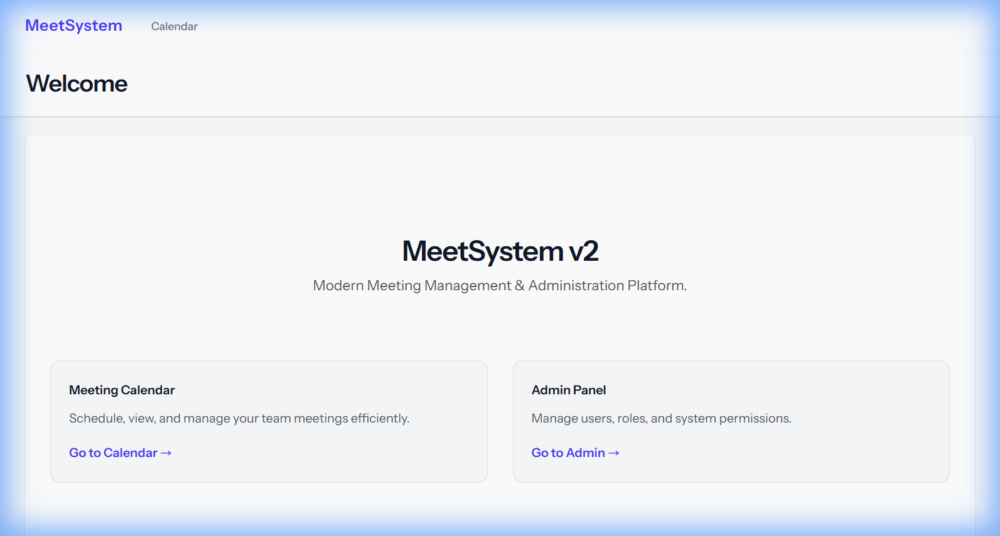
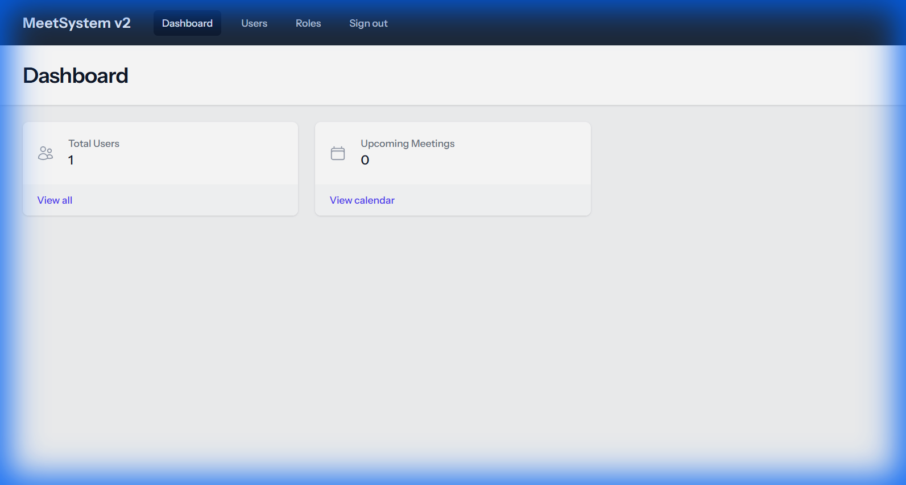
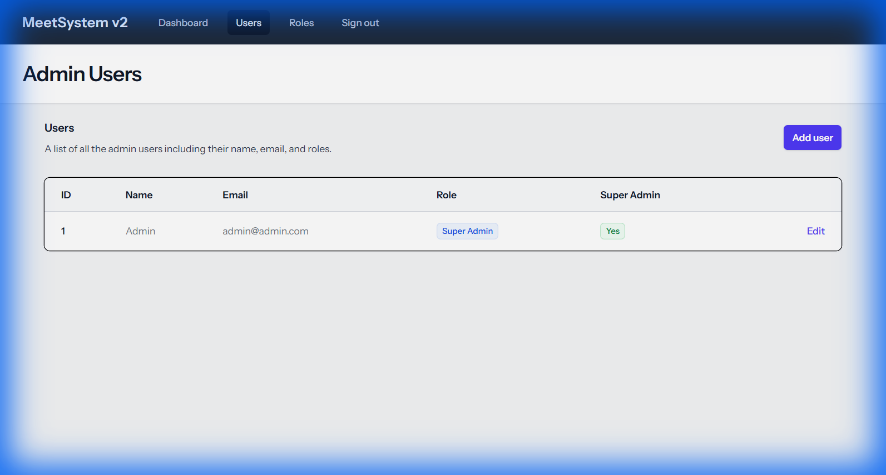

# MeetSystem v2 (2025 重寫版)

這是一個基於 Laravel 11 與 Docker 建構的現代化會議室管理系統，旨在取代舊有的 v1 版本。

## 🛠️ 技術堆疊 (Tech Stack)

- **後端框架**: Laravel 11.x (PHP 8.2)
- **前端技術**: Blade Templates + Tailwind CSS (via Vite)
- **資料庫**: MySQL 8.0
- **開發環境**: Docker Compose (Nginx + PHP + MySQL + Node/Vite + phpMyAdmin)

## 📸 系統截圖 (Screenshots)

| 前台首頁 | 後台登入 |
| :---: | :---: |
|  |  |
| **首頁 (Tailwind CSS)** | **Admin Login** |

| 後台儀表板 | 使用者管理 (CRUD) |
| :---: | :---: |
|  |  |
| **Dashboard** | **User Management** |

---

## 🚀 快速啟動 (Quick Start)

### 方式一：一鍵啟動 (Windows 推薦)
直接雙擊執行本目錄下的 **`start_v2.bat`** 腳本。
> 它會自動檢查 Docker 狀態、啟動服務、清理快取，並開啟瀏覽器。

### 方式二：手動指令 (Terminal)
若您習慣使用終端機，請在 `v2` 目錄下執行：

```bash
# 啟動所有服務 (背景執行)
docker compose up -d

# 停止服務
docker compose down
```

---

## 🔑 環境存取與帳號資訊 (Access Credentials)

| 服務名稱 | 網址 (URL) | 帳號 / 用戶名 | 密碼 / 備註 |
| :--- | :--- | :--- | :--- |
| **前台首頁** | [http://localhost:8081](http://localhost:8081) | (無須登入) | - |
| **後台管理系統** | [http://localhost:8081/admin](http://localhost:8081/admin) | `admin@admin.com` | `123456` |
| **資料庫管理 (phpMyAdmin)** | [http://localhost:8082](http://localhost:8082) | User: `laravel`<br>Server: `db` | `password` |
| **Vite 開發伺服器** | http://localhost:5173 | - | 提供 HMR 熱更新功能 |

---

## 📂 常用開發指令

在開發過程中，您可能需要執行以下指令 (請在 `v2` 目錄下執行)：

```bash
# 1. 清理所有快取 (Config, Route, View) - 遇到 500 錯誤時優先嘗試
docker compose exec app php artisan optimize:clear

# 2. 執行資料庫遷移 (Migration)
docker compose exec app php artisan migrate

# 3. 進入 PHP 容器 (Bash Shell)
docker compose exec app bash

# 4. 查看應用程式日誌
docker compose logs -f app
```

## ⚠️ 注意事項
- 本專案使用 **Port 8081** (Web) 與 **8082** (DB UI)，以避免與 v1 (Port 8000) 衝突。
- 專案依賴 Docker Desktop，請確保其已啟動 (亮綠燈)。
